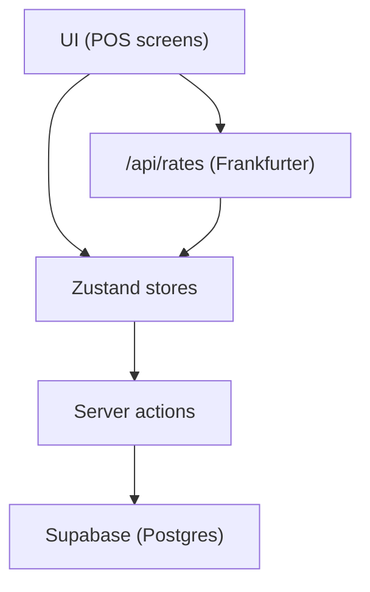

# Barn Coffee POS — Portfolio-Ready Case Study

A barista-first point-of-sale product demo built with Next.js. It includes a fast cashier flow, inventory with recipe-based stock, and sales reporting — shaped as a realistic, end‑to‑end case study for portfolio review.

## Portfolio Highlights
- End‑to‑end POS flows: cashier, inventory, menu, and reporting
- Realistic data model (recipes, stock deductions, daily sales)
- Bilingual UI (ID/EN) with currency‑aware formatting
- Live exchange‑rate conversion (Frankfurter API)
- Mobile‑friendly layout (drawer nav + cart on small screens)
- Demo mode that works without backend setup

## What’s Included
- Cashier experience with product search, category filters, and checkout
- Inventory tracking and low-stock alerts
- Menu management with recipe ingredients
- Sales reports (daily / weekly / monthly) + CSV export
- Bilingual UI (ID / EN) with currency-aware formatting
- Demo mode (works without Supabase)

## Demo Mode
The app works out of the box without any backend. Login accepts any email/password and uses in-memory + localStorage data for a smooth portfolio demo.

## Screenshots


## Logic & Data Flow


## Checkout Flow
1. Cashier taps products to add items to cart (Zustand store).
2. Totals are calculated in base currency (IDR).
3. Display values are converted using live exchange rates.
4. Payment is entered in selected currency and converted back to IDR for validation.
5. Order and order_items are written via server actions; inventory is deducted.

## Currency Conversion Logic
- Base currency: IDR
- Display: prices/totals are converted to selected currency using live rates.
- Input: product prices and costs remain in IDR to avoid accidental conversions.
- Rates: fetched from Frankfurter via `/api/rates` and cached in the client store.

## Local Development
```bash
npm install
npm run dev
```
Open `http://localhost:3000`.

## Supabase Setup (Optional)
This app can be connected to Supabase for persistent data.

1. Create a Supabase project and open the SQL editor.
2. Run `supabase/schema.sql`.
3. Run `supabase/seed.sql`.
4. Create `.env.local` (copy from `.env.example`):

```bash
NEXT_PUBLIC_SUPABASE_URL=your_supabase_url
NEXT_PUBLIC_SUPABASE_ANON_KEY=your_supabase_anon_key
NEXT_PUBLIC_SITE_URL=http://localhost:3000
```

## Routes
- `/` → Portfolio landing page (case study)
- `/login` → Demo login
- `/pos` → Cashier screen
- `/pos/inventory` → Inventory management
- `/pos/menu` → Menu management
- `/pos/reports` → Reports
- `/pos/settings` → Settings

## Portfolio Checklist
- Landing page + case study narrative ✅
- Live demo flow ✅
- Responsive layout ✅
- Accessible controls & form labels ✅
- Test coverage (unit + basic E2E) ✅

## Tests
```bash
# unit tests
npm run test

# e2e tests
npm run test:e2e
```

## Tech Stack
- Next.js (App Router)
- Supabase (Auth + Postgres)
- Zustand
- Tailwind CSS
- Radix UI
- Lucide Icons

## Notes
- Demo product images live in `public/images/products`.
- The OpenGraph image is generated at build/runtime with `src/app/opengraph-image.tsx`.
